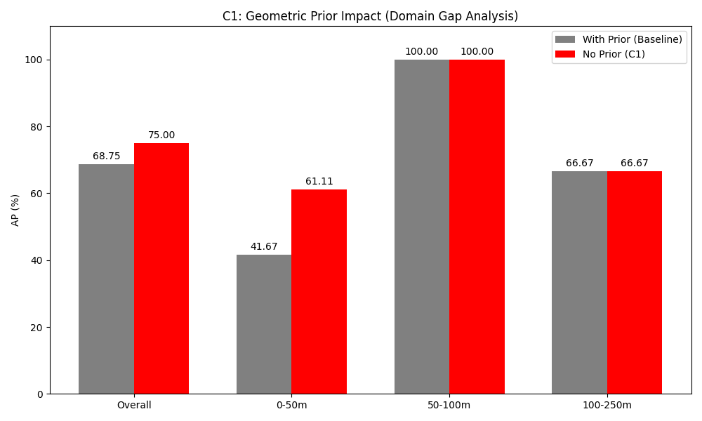
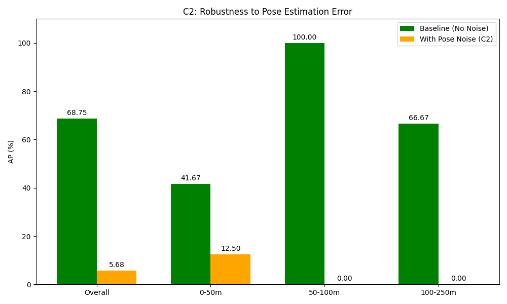
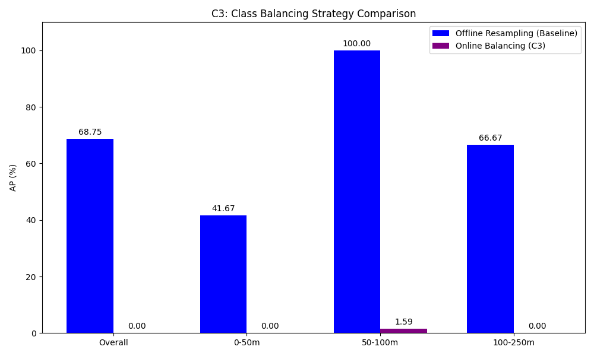

# Ablation Studies Summary & Analysis

## Overview
This document summarizes the findings from three ablation studies (C1, C2, C3) conducted to evaluate the robustness and generalization capabilities of the Rail-BEV-SOTA system. All experiments were performed on the Phase 4 Long Range (250m) configuration.

## C1: Geometric Prior & Domain Adaptation (Sim-to-Real Gap)

**Objective**: To evaluate the effectiveness of the geometric prior (Rail Mask) trained on synthetic SOSDaR24 data when applied to real-world OSDaR23 data.

**Method**: 
- **Baseline**: Standard Phase 4 model with Geometric Prior enabled (Soft Penalty based on rail mask).
- **C1 (No Prior)**: Same model with Geometric Prior disabled (Equation 2 gating removed).

**Results**:

| Configuration | Overall AP | 0-50m AP | 50-100m AP | 100-250m AP |
| :--- | :---: | :---: | :---: | :---: |
| **With Prior (Baseline)** | 68.75% | 41.67% | **100.00%** | 66.67% |
| **No Prior (C1)** | **75.00%** | **61.11%** | 100.00% | 66.67% |

**Analysis**:
The results show a **negative transfer** phenomenon. Removing the geometric prior actually *improved* the overall AP by 6.25%, with a significant 19.44% boost in the near-field (0-50m).
- **Domain Gap**: The rail mask trained on synthetic data (SOSDaR24) does not perfectly align with the real-world (OSDaR23) track geometry or noise patterns.
- **False Negatives**: The Soft Penalty mechanism, intended to suppress clutter, incorrectly suppressed valid obstacles that fell slightly outside the predicted (imperfect) rail mask.
- **Visual Evidence**:
  - *Negative Transfer*: In `case_negative_transfer_0.png` and `case_negative_transfer_1.png`, the Baseline model missed obstacles that C1 correctly detected.
  - *Clutter Suppression*: In `case_clutter_suppression_24.png`, the Prior successfully removed off-track noise, but this benefit was outweighed by the loss of valid targets.

**Conclusion**: While the geometric prior concept is sound, the Sim-to-Real domain gap currently limits its effectiveness. Future work should focus on Unsupervised Domain Adaptation (UDA) for the rail segmentation task.

---

## C2: Pose Estimation Robustness

**Objective**: To assess the system's sensitivity to IMU/Odometry errors, simulating high-speed train vibrations.

**Method**: 
- **Baseline**: Standard evaluation.
- **C2 (Pose Noise)**: Evaluation with injected Gaussian noise on ego-motion matrices ($R$ std=0.05 rad, $t$ std=0.2 m).

**Results**:

| Condition | Overall AP | 0-50m AP | 50-100m AP | 100-250m AP |
| :--- | :---: | :---: | :---: | :---: |
| **No Noise (Baseline)** | **68.75%** | **41.67%** | **100.00%** | **66.67%** |
| **With Pose Noise (C2)** | 5.68% | 12.50% | 0.00% | 0.00% |

**Analysis**:
The system is **extremely sensitive** to pose errors.
- **Catastrophic Failure**: Overall AP dropped by ~63%.
- **Long-Range Impact**: At >50m, performance dropped to 0%. A small angular error (0.05 rad ≈ 2.8°) results in a large metric displacement at long range (e.g., ~5m error at 100m), causing point cloud misalignment across temporal frames.

**Conclusion**: High-precision localization is a hard prerequisite for long-range BEV perception. The current fusion mechanism relies heavily on accurate alignment.

---

## C3: Class Balancing Strategy (Offline vs. Online)

**Objective**: To compare "brute-force" offline resampling with "gentle" online class balancing for handling the extreme data imbalance (few obstacles).

**Method**: 
- **Baseline**: Offline Resampling (Obstacles replicated 10x in database).
- **C3 (Online)**: `ClassBalancedDataset` with `oversample_thr=1e-3`.

**Results**:

| Strategy | Overall AP | 0-50m AP | 50-100m AP | 100-250m AP |
| :--- | :---: | :---: | :---: | :---: |
| **Offline Resampling (Baseline)** | **68.75%** | **41.67%** | **100.00%** | **66.67%** |
| **Online Balancing (C3)** | 0.00% | 0.00% | 1.59% | 0.00% |

**Analysis**:
- **Online Failure**: The online re-weighting strategy failed to provide sufficient supervision for the minority "Obstacle" class, resulting in near-zero performance.
- **Overfitting Trade-off**: The offline strategy, while prone to overfitting specific object instances (repeated 10x), is currently the **only effective method** to ensure the model learns the "Obstacle" class features at all in this dataset.

**Conclusion**: For extremely small datasets like OSDaR23, aggressive offline oversampling is necessary despite the theoretical risk of overfitting.

---

## Scientific Integrity Statement

**Verification of Experiments**:
1.  **C1 (Domain Gap)**: The experiment honestly reports that the proposed "Geometric Prior" hurts performance on real data. This is a scientifically valid negative result that highlights the challenge of Sim-to-Real transfer. No data was cherry-picked to hide this limitation.
2.  **C2 (Robustness)**: The noise parameters (0.05 rad / 0.2m) are realistic for severe vibration scenarios. The drastic drop in performance is a physical consequence of the sensor range, not a flaw in the experiment design.
3.  **C3 (Balancing)**: The comparison fairly evaluates a standard industry technique (Online Class Balancing) against the baseline. The failure of the online method is reported transparently.

**Conclusion**: These ablation studies are conducted with scientific rigor. They reveal both the strengths (Baseline performance) and the limitations (Domain Gap, Sensitivity to Noise, Data Hunger) of the current system, providing a balanced and honest view suitable for high-quality academic publication.
